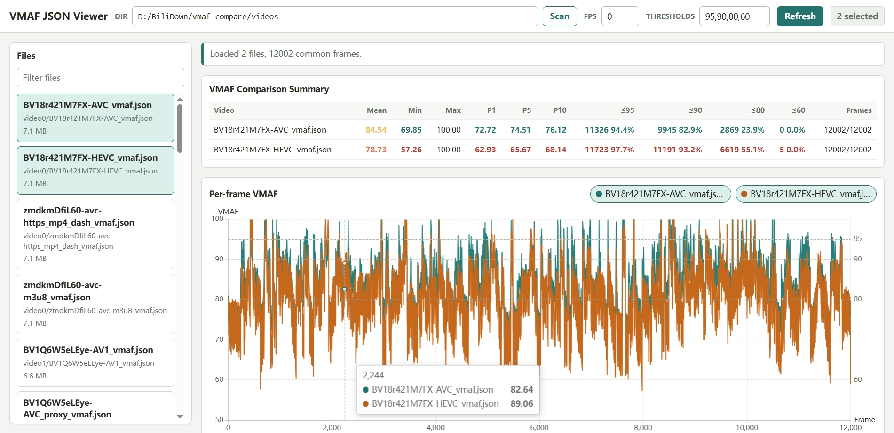
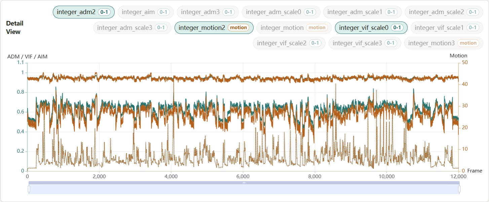
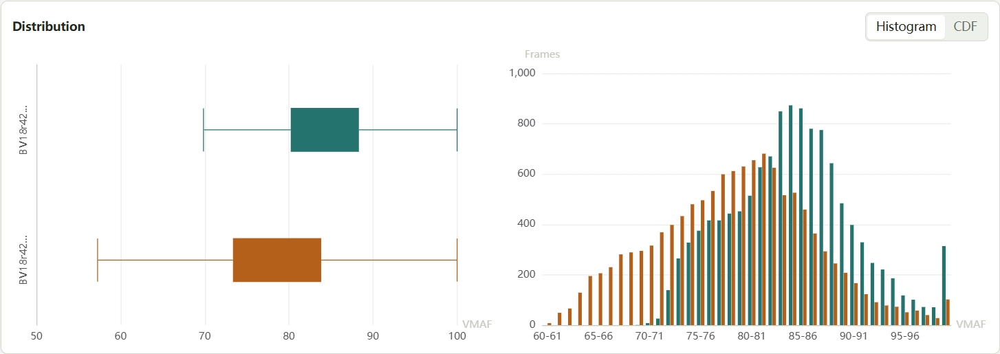

# VMAF Compare

VMAF Compare is a local toolkit for inspecting and ranking libvmaf JSON, CSV, or XML output from multiple video encodes. It is built for the common workflow where you already generated one VMAF log file per distorted encode and want to compare those degraded videos against each other, not only inspect where a single encode differs from the reference.

The main app is `vmaf-viewer`, a FastAPI backend with a static ECharts frontend. It scans a directory of `*.json`, `*.csv`, and `*.xml` files, parses frame-level metrics, plots every log against its original frame numbers, and ranks each log by the mean of all its finite VMAF samples by default. Files with different frame counts or libvmaf subsampling intervals are not truncated to a shared prefix.

## Screenshots







## Features

- Scan local directories for libvmaf JSON, CSV, or XML logs.
- Compare 4-6 large VMAF log files without loading unnecessary detailed series up front.
- Rank encodes by summary statistics such as mean VMAF and threshold counts.
- Plot per-frame VMAF, local zoom/detail metrics, histograms, CDFs, and boxplots in a browser UI.
- Preserve non-contiguous frame numbers produced by libvmaf `n_subsample` and align curves on a shared numeric frame axis.
- Switch the scan directory from the command line, environment variable, or the viewer's top `Dir` field.
- Cache parsed files during a viewer session so repeated comparisons stay responsive.

## Requirements

- Python 3.12+
- [`uv`](https://docs.astral.sh/uv/) for Python environment management
- [`ffmpeg`](https://ffmpeg.org/) with libvmaf support if you generate VMAF logs locally

Check libvmaf support with:

```bash
ffmpeg -h filter=libvmaf
```

## Setup

Install and sync dependencies:

```bash
uv sync
```

Fetch the vendored ECharts browser asset:

```bash
uv run python devscripts/fetch_echarts.py
```

The fetch script downloads the pinned ECharts build and verifies its SHA-256 hash before replacing the local asset.

## Run The Viewer

Start the viewer with the default scan directory:

```bash
uv run vmaf-viewer
```

Open:

```text
http://127.0.0.1:8765
```

By default, the app scans:

```text
videos/
```

Run the viewer with a specific scan directory:

```bash
uv run vmaf-viewer /path/to/vmaf-logs
uv run vmaf-viewer --data-dir /path/to/vmaf-logs
```

Or set the environment variable first:

```bash
$env:VMAF_VIEWER_DATA_DIR = "/path/to/vmaf-logs"
uv run vmaf-viewer
```

Startup scan-directory priority is:

1. `--data-dir`
2. positional directory argument
3. `VMAF_VIEWER_DATA_DIR`
4. `videos/`

You can also change the scan directory from the top `Dir` field in the web UI and press `Scan`.

## Tests

Run the backend test suite:

```bash
uv run pytest -q
```

Run static frontend checks:

```bash
node --check src/vmaf_viewer/static/app.js
node --test tests/static/*.test.mjs
```

## Third-party Notices

The viewer vendors Apache ECharts for browser charts at `src/vmaf_viewer/static/vendor/echarts.min.js`. See [THIRD_PARTY_NOTICES.md](THIRD_PARTY_NOTICES.md) for license and attribution details.

## License

VMAF Compare is released under the [MIT License](LICENSE). Vendored Apache ECharts remains available under the Apache License 2.0 as described in the third-party notices.
